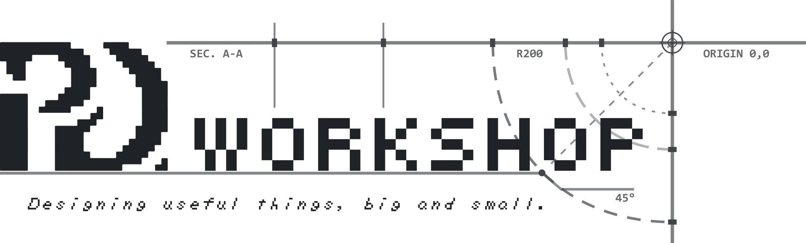
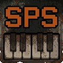
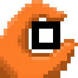
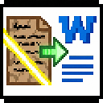
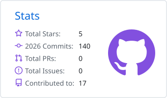
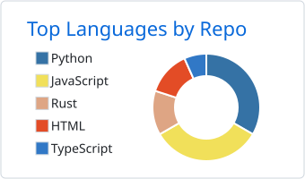
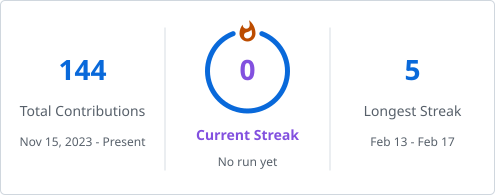

<picture>
  <source media="(prefers-color-scheme: dark)" srcset="repo_icons/IPD_pixel_logo3.svg">
  <source media="(prefers-color-scheme: light)" srcset="repo_icons/IPD_pixel_logo3-light.svg">
  
</picture>

*Tools that solve real problems — native desktop apps, 3D modeling addons, browser extensions, and AI-powered utilities.*

---

**`Rust`** · **`Python`** · **`TypeScript`** · **`JavaScript`**

 

## 🚀 Featured Projects

### 🖥️ Desktop Applications

<table>
<tr>
<td width="50%">

<h4 align="center">  <a href="https://github.com/mantukin/dx3">Dx3 Controller</a></h4>

Lightweight **DualSense → Xbox 360** converter & remapper for Windows. Only ~5 MB RAM, zero input latency, battery-friendly.

`Rust` `Tauri` `JavaScript`

</td>
<td width="50%">

<h4 align="center">  <a href="https://github.com/mantukin/image-pinboard">Image Pinboard</a></h4>

A lightning-fast desktop workspace for reference images. Infinite canvas, drag & drop, always-on-top transparent overlays, annotations, color picking, and sticky notes.

`Rust` `Tauri` `JavaScript` `CSS`

</td>
</tr>
<tr>
<td width="50%">

<h4 align="center">  <a href="https://github.com/mantukin/DragNProp">DragNProp</a></h4>

Offline-first 3D asset manager and companion with native drag-and-drop support, recursive search, automatic previews, and local SQLite engine.

`Rust` `Tauri` `Svelte` `SQLite`

</td>
<td width="50%">

<h4 align="center">  <a href="https://github.com/mantukin/spectral-pad-sampler">Spectral Pad Sampler</a></h4>

Rust-powered sound-design toolkit and VST3 plugin for creating atmospheric ambient pads from spectral fingerprints of any audio source.

`Rust` `Tauri` `JavaScript` `nih-plug`

</td>
</tr>
</table>

---

### 🧩 Blender Addons

<table>
<tr>
<td width="33%">

#### [🔲 Quick Retopo](https://github.com/mantukin/quick-retopo)

Interactive quad-based retopology. Draw strips on surfaces, extend grids, stitch meshes with snapping & straightening tools.

`Python`

</td>
<td width="33%">

#### [👁️ Custom Object Transparency](https://github.com/mantukin/CustomObjectTransparency)

Per-object opacity control and global X-Ray transparency via intuitive N-panel sliders.

`Python`

</td>
<td width="33%">

#### [🎯 ExocadControls](https://github.com/mantukin/ExocadControls)

Exocad-style edge-zone navigation. Roll & pan by dragging near viewport edges. Infinite cursor warping.

`Python`

</td>
</tr>
</table>

---

### 🌐 Browser Extensions

<table>
<tr>
<td width="50%">

<h4 align="center">  <a href="https://github.com/mantukin/AudioGrabber">AudioGrabber</a></h4>

Capture audio from any browser tab with automatic silence detection, waveform editing, looping, and high-quality WAV export. Works on all Chromium browsers.

`JavaScript` `Web Audio API` `Manifest V3`

</td>
<td width="50%">

<h4 align="center">  <a href="https://github.com/mantukin/spotify-gemini-suggester">Spotify Gemini Suggester</a></h4>

AI-powered music discovery using Google Gemini. Find tracks by mood, genre, decade, or natural language. Instant Spotify playback.

`JavaScript` `Gemini API` `Spotify API`

</td>
</tr>
</table>

---

### 🖱️ Web Apps

<table>
<tr>
<td width="50%">

<h4 align="center">  <a href="https://github.com/mantukin/shakalfx">ShakalFX</a></h4>

Retro-styled browser app for ASCII conversion, dithering, glitch effects, and animated GIF exports. <a href="https://mantukin.github.io/shakalfx/">Open live app</a>.

`React` `Vite` `Canvas` `Web Workers`

</td>
<td width="50%">

<h4 align="center">  <a href="https://github.com/mantukin/motif">Motif</a></h4>

AI-assisted MIDI composition and sequencing app with piano roll editing, drum sequencing, voice melody + karaoke workflow, and audio-to-MIDI transcription for building ideas before finishing them in a DAW. <a href="https://mantukin.github.io/motif/">Open live app</a>.

`React` `TypeScript` `Tone.js` `Basic Pitch`

</td>
</tr>
 </table>

---

### 🛠️ Utilities

<table>
<tr>
<td width="50%">

<h4 align="center">  <a href="https://github.com/mantukin/window-manager">Window Manager</a></h4>

Force borderless mode, auto-move apps to specific monitors, persistent per-app settings, background monitoring, system tray support.

`Python` `Win32 API`

</td>
<td width="50%">

<h4 align="center">  <a href="https://github.com/mantukin/word-ai-ocr">Word AI OCR</a></h4>

Microsoft Word add-in for document layout reconstruction. Convert scans & photos into formatted Word documents via AI — **no API keys required**.

`TypeScript` `JavaScript` `Office Add-in`

</td>
</tr>
<tr>
<td colspan="2">

<h4 align="center">  <a href="https://github.com/mantukin/PDFill">PDFill</a></h4>

Visual editor and CLI for designing, aligning, and exporting fillable PDF form fields with grid snapping, multi-page workflows, and batch processing.

`Python` `PySide6` `PyMuPDF` `CLI`

</td>
</tr>
</table>

---

 

## 🧰 Tech Stack

 

## 📊 GitHub Stats

<picture>
  <source media="(prefers-color-scheme: dark)" srcset="repo_icons/github-stats/stats.svg">
  <source media="(prefers-color-scheme: light)" srcset="repo_icons/github-stats/stats-light.svg">
  
</picture>
<picture>
  <source media="(prefers-color-scheme: dark)" srcset="repo_icons/github-stats/languages.svg">
  <source media="(prefers-color-scheme: light)" srcset="repo_icons/github-stats/languages-light.svg">
  
</picture>

<picture>
  <source media="(prefers-color-scheme: dark)" srcset="repo_icons/github-stats/streak.svg">
  <source media="(prefers-color-scheme: light)" srcset="repo_icons/github-stats/streak-light.svg">
  
</picture>

---

*Every tool here started as a personal itch — something I needed, couldn't find, and decided to build myself.*

